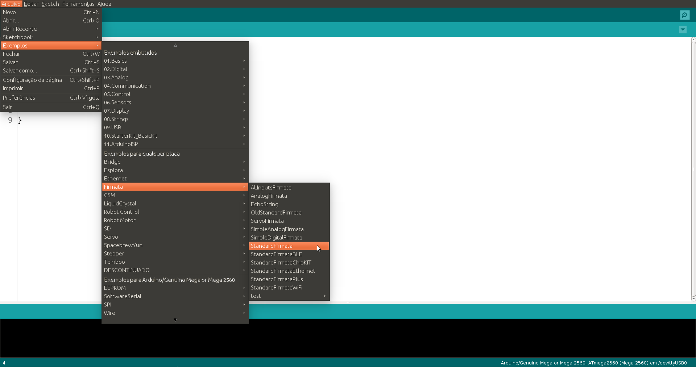
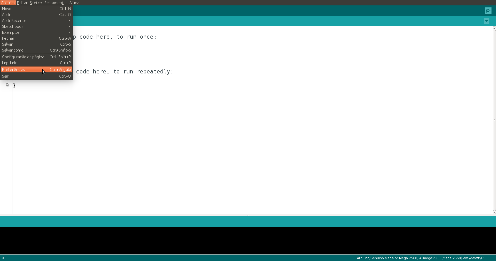
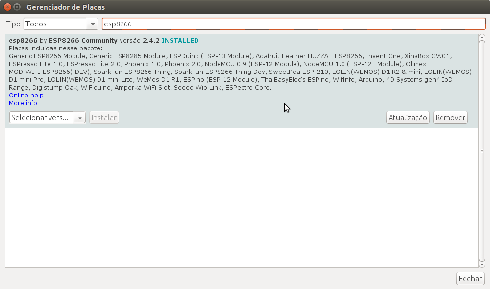

# Javascript para Arduino e NodeMCU ESP8266 - Início
<!--<link href="styles.css" rel="stylesheet" link/> 
     -->

<p align="center">
  
</p>

Você sabia que dá pra usar Javascript para controlar um Arduino!? E uma ESP8266?! Pois é, também fiquei impressionado quando descobri! Para conseguir fazer isso, você só precisa compilar um código na sua placa, o StandardFirmata (para arduino) ou StandardFirmataWifi (para ESP8266) e pronto, a placa já está pronta para ser controlada através do Javascript.

O [Firmata](https://github.com/firmata/protocol "Página sobre o protocolo") é um protcolo de comunicação que permite a comunicação de microcontroladores com softwares de um computador, tablet ou até celulares, por exemplo. O protocolo pode ser implementado em qualquer arquitetura de microcontroaldor, assim como o software pode ser implementado em qualquer dispositivo, com tanto que as bibliotecas padrão consigam ser utilizadas. A seguir você pode dar uma olhadinha em algumas bibliotecas que você pode utilizar para controlar sua placa:

- [Johnny-Five](https://github.com/rwaldron/johnny-five "Biblioteca Johnny-Five")
- [Breakout.js](http://breakoutjs.com/ "Biblioteca BreakoutJS")
- [Firmata.js](https://github.com/firmata/firmata.js "Biblioteca Firmata.js")
- [CylonJS](https://cylonjs.com/ "Biblioteca CylonJS")

Dentre as opções citadas, utilizaremos o Johnny-Five. Antes de começar, precisamos preparar as ferramentas necessárias para começar a programar.

## O que devemos instalar e configurar?

Para rodar e testar o Javascript nas placas você precisará de duas ferramentas muito importantes (clique no link para acessar a página e baixar):

- [NodeJS]("https://nodejs.org/en/" "Link para download do NodeJS")
- [NPM]("https://www.npmjs.com/get-npm" "Site oficial do NPM")

### Configuraçãoda IDE do Arduino para Arduino

Se utilizar um Arduino para a realização desse tutorial, precisará apenas instalar a [IDE do Arduino]("https://www.arduino.cc/en/Main/Software" "Página de download da IDE") para configurar a placa.

Depois de instalar a IDE, agora precisará compilar o código referente ao protocolo de comunicação Firmata. Ele está localizado em **Arquivo > Exemplos > Firmata > StandardFirmata**. Lembrando que esse código deve ser compilado numa placa **Arduino**.

<p align="center">
  
  <p align="center">Programa utilizado na placa para receber comandos Javascript</p>
</p>

Depois carregue esse código na placa arduino e estará configurado para a próxima etapa.

### Configuraçãoda IDE do Arduino para NodeMCU

Se utilizar uma NodeMCU para a realização desse tutorial, precisará instalar a [IDE do Arduino]("https://www.arduino.cc/en/Main/Software" "Página de download da IDE") para configurar a placa. Após a instalação, deverá instalar os pacotes para utilização da placa com ESP8266. Para isso, vá em **Arquivo > Preferências**.

<p align="center">
  
  <p align="center">Janela Preferrências serve para adição de pacotes</p>
</p>

Depois basta colar o link a seguir no campo *URLs Adicionais para Gereniadores de Placas*.

```http://arduino.esp8266.com/stable/package_esp8266com_index.json```

<p align="center">
  
  <p align="center">URL adicionada em preferências</p>
</p>

Para finalizar a configuração da NodeMCU, vá em **Ferramentas > Placa > Gerenciador de Placas...**

<p align="center">
  
  <p align="center">Gerenciador de atualização e instalação de diversos tipos de placas</p>
</p>

Pesquise por esp8266 e instale a versão que aparece indicada por ESP8266 Community.

<p align="center">
  
  <p align="center">Instalação necessária para programar no NodeMCU</p>
</p>

Agora precisará compilar o código referente ao protocolo de comunicação Firmata. Ele está localizado em **Arquivo > Exemplos > Firmata > StandardFirmataWifi**. Lembrando que esse código deve ser compilado numa placa **NodeMCU**.